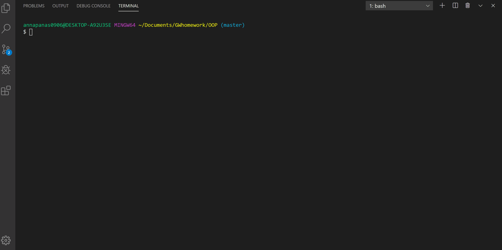

For this assignment I built a software engineering team generator command line application, that takes information about employee type and displays that information in generated text file. This application would be useful for a manager, that wants to have a file that holds information like name, email, id etc. about his employees.

 Node packages used to build this CLI:

 * npm inquirer for prompting user to get information
 * npm fs for reading, writing and appending to a file
 * npm jest for unit testing

There are 3 classes (class is a blueprint for creating objects in OOP): Manager, Engineer and Intern that extend from their parent class Employee. Each of three classes has it's own unique properties and methods in addition to their parent's properties and methods.

An application will start from prompting a manager for  his/her's information, take that data and write it to a text file.  After that, manager is given a choise of what type of a member he/she would like to add. Once a member type is picked, the application will do the the same steps: ask for Engineer's or Interns info, append it into a text file and promp to chose a mamber type. If a manager chooses not to add any more members into a file, he or she will recieve aa message that text file has been generated.I also added an inquirer validation to check whether user's email address is valid.

I've been using 'jest' to test the application and all unit tests pass.

